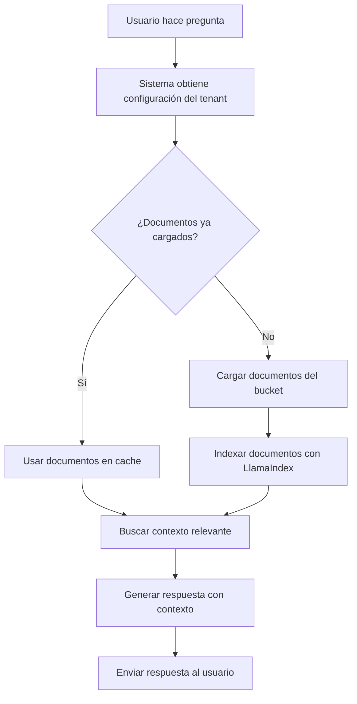

# Integración LlamaIndex con Documentos del Cliente

## Descripción

Esta integración permite que el chatbot tenga acceso al contexto específico de cada cliente a través de sus documentos almacenados en buckets. Utiliza LlamaIndex para indexar documentos y proporcionar contexto relevante a la IA de Gemini.

## Características

### ✅ Funcionalidades Implementadas

1. **Carga Automática de Documentos**: Los documentos se cargan automáticamente cuando un usuario hace una pregunta
2. **Soporte Multi-Formato**: 
   - Archivos de texto (.txt, .md)
   - Documentos PDF (.pdf)
   - Documentos Word (.docx)
3. **Indexación Vectorial**: Usa LlamaIndex para crear índices vectoriales de los documentos
4. **RAG (Retrieval-Augmented Generation)**: Combina búsqueda semántica con generación de texto
5. **Cache Inteligente**: Mantiene documentos cargados en memoria para mejorar rendimiento
6. **API REST**: Endpoints para gestionar documentos por tenant

### 🔧 Componentes Principales

#### 1. DocumentContextService
- **Archivo**: `services/document_context_service.py`
- **Función**: Carga, indexa y gestiona documentos del cliente
- **Características**:
  - Soporte para múltiples tipos de buckets (GCS, S3, URLs directas)
  - Extracción de texto de PDF y Word
  - Cache de índices por tenant
  - Búsqueda semántica con contexto relevante

#### 2. AIService (Actualizado)
- **Archivo**: `services/ai_service.py`
- **Función**: Integra contexto de documentos en respuestas de IA
- **Características**:
  - Carga automática de documentos por tenant
  - Incorporación de contexto relevante en prompts
  - Respuestas más precisas y específicas del cliente

#### 3. ChatController (Actualizado)
- **Archivo**: `controllers/chat_controller.py`
- **Función**: Endpoints para gestionar documentos
- **Endpoints**:
  - `POST /tenants/{tenant_id}/load-documents`
  - `GET /tenants/{tenant_id}/documents/info`
  - `DELETE /tenants/{tenant_id}/documents`

## Configuración

### 1. Variables de Entorno

```bash
# Ya configuradas en requirements.txt
GEMINI_API_KEY=tu_api_key_aqui
POLITICAL_REFERRALS_SERVICE_URL=http://localhost:8080
```

### 2. Configuración del Tenant

En la base de datos del cliente, agrega la URL del bucket de documentos:

```json
{
  "aiConfig": {
    "documentation_bucket_url": "https://storage.googleapis.com/tu-bucket/documents/",
    "model": "gemini-2.0-flash-exp",
    "temperature": 0.7
  }
}
```

### 3. Dependencias Adicionales

```bash
# Instalar dependencias para procesamiento de documentos
pip install PyPDF2 python-docx
```

## Uso

### Carga Automática

Los documentos se cargan automáticamente cuando:
1. Un usuario hace una pregunta sobre la campaña
2. El sistema detecta que necesita contexto específico del cliente
3. Es la primera vez que se accede al tenant

### Carga Manual

```bash
# Cargar documentos manualmente
curl -X POST "http://localhost:8000/api/v1/tenants/daniel_dev/load-documents" \
  -H "Content-Type: application/json" \
  -d '{
    "documentation_bucket_url": "https://storage.googleapis.com/tu-bucket/documents/"
  }'
```

### Verificar Documentos Cargados

```bash
# Ver información de documentos cargados
curl "http://localhost:8000/api/v1/tenants/daniel_dev/documents/info"
```

## Flujo de Trabajo



## Formatos de Documentos Soportados

### 1. Archivos de Texto
- **Extensiones**: `.txt`, `.md`
- **Procesamiento**: Directo como texto plano
- **Uso**: Manifiestos, propuestas, información general

### 2. Documentos PDF
- **Extensión**: `.pdf`
- **Procesamiento**: Extracción de texto con PyPDF2
- **Uso**: Documentos oficiales, presentaciones, reportes

### 3. Documentos Word
- **Extensión**: `.docx`
- **Procesamiento**: Extracción de texto con python-docx
- **Uso**: Documentos de trabajo, borradores, comunicados

## Ejemplos de Uso

### Pregunta del Usuario
```
Usuario: "¿Cuáles son las principales propuestas de educación?"
```

### Procesamiento del Sistema
1. **Carga de documentos**: Si no están cargados, descarga desde el bucket
2. **Indexación**: Crea índice vectorial con LlamaIndex
3. **Búsqueda semántica**: Encuentra documentos relevantes sobre educación
4. **Generación de respuesta**: Usa contexto específico + IA para responder

### Respuesta Generada
```
"Según nuestro plan de educación, las principales propuestas incluyen:
1. Mejora de la infraestructura escolar
2. Capacitación docente
3. Tecnología educativa
4. Acceso universal a la educación

[Contexto extraído de documentos específicos del cliente]"
```

## Monitoreo y Logs

### Logs Importantes
```bash
# Carga de documentos
INFO: Cargando documentos para tenant daniel_dev desde: https://storage.googleapis.com/...

# Indexación exitosa
INFO: Índice creado exitosamente para tenant daniel_dev con 5 documentos

# Uso de contexto
INFO: Contexto relevante obtenido para tenant daniel_dev: 1250 caracteres

# Errores comunes
WARNING: No se encontraron documentos en el bucket para tenant daniel_dev
ERROR: Error cargando documento manifesto.pdf: formato no soportado
```

## Troubleshooting

### Problemas Comunes

#### 1. Documentos no se cargan
```bash
# Verificar URL del bucket
curl "http://localhost:8000/api/v1/tenants/daniel_dev/documents/info"

# Verificar configuración del tenant
curl "http://localhost:8080/api/v1/tenants/daniel_dev"
```

#### 2. Error de dependencias
```bash
# Instalar dependencias faltantes
pip install PyPDF2 python-docx

# Verificar instalación
python -c "import PyPDF2; import docx; print('Dependencias OK')"
```

#### 3. Memoria insuficiente
```bash
# Limpiar cache de documentos
curl -X DELETE "http://localhost:8000/api/v1/tenants/daniel_dev/documents"
```

### Debugging

```python
# Verificar estado del servicio
import httpx

async def check_service():
    async with httpx.AsyncClient() as client:
        response = await client.get("http://localhost:8000/health")
        print(response.json())

# Verificar documentos cargados
async def check_documents(tenant_id):
    async with httpx.AsyncClient() as client:
        response = await client.get(f"http://localhost:8000/api/v1/tenants/{tenant_id}/documents/info")
        print(response.json())
```

## Próximas Mejoras

### 🚀 Funcionalidades Planificadas

1. **Soporte para más formatos**:
   - PowerPoint (.pptx)
   - Excel (.xlsx)
   - Imágenes con OCR

2. **Optimizaciones de rendimiento**:
   - Indexación incremental
   - Compresión de índices
   - Cache distribuido

3. **Funcionalidades avanzadas**:
   - Búsqueda por fechas
   - Filtros por tipo de documento
   - Análisis de sentimientos

4. **Integración con más proveedores**:
   - Dropbox
   - OneDrive
   - SharePoint

## Script de Prueba

Usa el script incluido para probar la integración:

```bash
# Ejecutar pruebas completas
python test_document_integration.py

# Ver ayuda
python test_document_integration.py --help
```

## Soporte

Para problemas o preguntas sobre la integración:

1. Revisa los logs del servicio
2. Verifica la configuración del tenant
3. Prueba con el script de prueba incluido
4. Consulta la documentación de LlamaIndex: https://docs.llamaindex.ai/

---

**Nota**: Esta integración está diseñada para ser escalable y eficiente. Los documentos se cargan una vez por tenant y se mantienen en cache para consultas posteriores.
