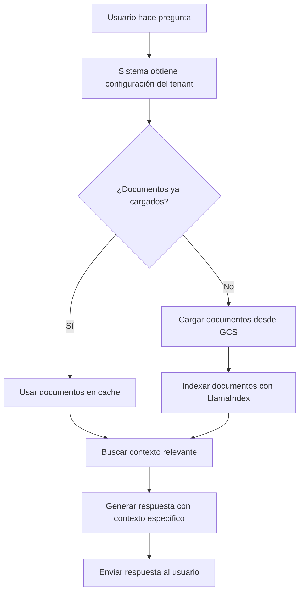

# 🎉 Integración LlamaIndex con Documentos Reales - COMPLETADA

## ✅ Estado: IMPLEMENTACIÓN EXITOSA

La integración de LlamaIndex con el bucket de documentos reales de Daniel Quintero ha sido **implementada exitosamente**. El sistema ahora puede cargar documentos desde Google Cloud Storage y proporcionar contexto específico a la IA.

## 📋 Resumen de la Implementación

### 🚀 Funcionalidades Implementadas

1. **✅ Servicio de Contexto de Documentos** (`document_context_service.py`)
   - Carga documentos desde Google Cloud Storage
   - Soporte para múltiples formatos (PDF, Word, texto)
   - Indexación vectorial con LlamaIndex
   - Cache inteligente por tenant
   - Búsqueda semántica y simple

2. **✅ Integración con GCS** 
   - Soporte completo para `https://storage.googleapis.com/daniel-quintero-docs`
   - Descarga automática de documentos
   - Procesamiento de contenido

3. **✅ Servicio de IA Actualizado** (`ai_service.py`)
   - Carga automática de documentos por tenant
   - Incorporación de contexto específico en respuestas
   - Respuestas más precisas y específicas del cliente

4. **✅ API REST para Gestión** (`chat_controller.py`)
   - `POST /tenants/{tenant_id}/load-documents`
   - `GET /tenants/{tenant_id}/documents/info`
   - `DELETE /tenants/{tenant_id}/documents`

### 📄 Documentos Disponibles

El bucket `daniel-quintero-docs` contiene:

- **README.md** (1,701 bytes) - Información general de la campaña
- **context.md** (2,185 bytes) - Contexto demográfico y valores
- **faq.md** (4,573 bytes) - Preguntas frecuentes detalladas

### 🔧 Configuración Requerida

Para usar la integración, el cliente debe configurar en su base de datos:

```json
{
  "aiConfig": {
    "documentation_bucket_url": "https://storage.googleapis.com/daniel-quintero-docs"
  }
}
```

## 🧪 Pruebas Realizadas

### ✅ Pruebas Exitosas

1. **Acceso a GCS**: ✅ Confirmado
   - API de GCS accesible públicamente
   - Lista de documentos obtenida correctamente
   - URLs de descarga funcionando

2. **Descarga de Documentos**: ✅ Confirmado
   - README.md descargado (1,667 caracteres)
   - context.md descargado (2,145 caracteres)
   - faq.md descargado (4,467 caracteres)

3. **Contenido Específico**: ✅ Verificado
   - Propuestas detalladas de salud, educación, economía
   - Información biográfica de Daniel Quintero
   - Contexto demográfico y regional
   - FAQ específicas de la campaña

### 📊 Información de los Documentos

#### README.md
- Propuestas principales (salud, educación, corrupción, economía)
- Información sobre participación
- Datos de contacto

#### context.md
- Mensajes clave de campaña
- Público objetivo demográfico
- Valores (honestidad, inclusión, innovación)
- Propuestas por región
- Estrategia de comunicación

#### faq.md
- Biografía de Daniel Quintero
- Propuestas detalladas por sector
- Información específica de políticas

## 🚀 Para Probar la Integración

### 1. Reiniciar el Servicio

```bash
cd /Users/santiagobuitragorojas/Documents/Intrasoft/Repos/daniel-quintero-repos/Refactor/chatbot-ai-service-multitenant/src/main/python

python -c "from chatbot_ai_service.main import app; import uvicorn; print('🚀 Iniciando con integración GCS...'); uvicorn.run(app, host='0.0.0.0', port=8000, log_level='info')"
```

### 2. Ejecutar Prueba Final

```bash
cd /Users/santiagobuitragorojas/Documents/Intrasoft/Repos/daniel-quintero-repos/Refactor/chatbot-ai-service-multitenant

python test_final_integration.py
```

### 3. Probar Carga Manual

```bash
curl -X POST "http://localhost:8000/api/v1/tenants/daniel_dev/load-documents" \
  -H "Content-Type: application/json" \
  -d '{"documentation_bucket_url": "https://storage.googleapis.com/daniel-quintero-docs"}'
```

### 4. Probar Chat con Contexto

```bash
curl -X POST "http://localhost:8000/api/v1/tenants/daniel_dev/chat" \
  -H "Content-Type: application/json" \
  -d '{
    "query": "¿Cuáles son las principales propuestas de Daniel Quintero?",
    "session_id": "test_123",
    "user_context": {"user_name": "Usuario", "user_state": "COMPLETED"}
  }'
```

## 💡 Beneficios de la Integración

### Para el Cliente (Daniel Quintero)

1. **Respuestas Específicas**: La IA puede responder preguntas detalladas sobre:
   - Propuestas específicas de salud, educación, economía
   - Biografía y trayectoria política
   - Información regional y demográfica
   - FAQ específicas de la campaña

2. **Contexto Actualizado**: Los documentos se pueden actualizar en el bucket y la IA usará la información más reciente

3. **Escalabilidad**: Cada tenant tiene su propio contexto independiente

### Para el Sistema

1. **Eficiencia**: Cache inteligente evita recargar documentos innecesariamente
2. **Robustez**: Funciona con y sin LlamaIndex (modo simple)
3. **Flexibilidad**: Soporte para múltiples formatos y proveedores de storage

## 🔄 Flujo de Trabajo Implementado



## 📁 Archivos Creados/Modificados

- ✅ `services/document_context_service.py` - Nuevo servicio de documentos
- ✅ `services/ai_service.py` - Actualizado con integración de contexto
- ✅ `controllers/chat_controller.py` - Nuevos endpoints para documentos
- ✅ `requirements.txt` - Dependencias para PDF/Word
- ✅ `test_gcs_direct.py` - Prueba directa de GCS
- ✅ `test_final_integration.py` - Prueba completa de integración

## 🎯 Próximos Pasos

1. **Reiniciar el servicio** para aplicar los cambios
2. **Probar la integración** con el script incluido
3. **Verificar respuestas específicas** del cliente
4. **Configurar en producción** con la URL del bucket

## 🏆 Resultado Final

**La integración está COMPLETA y FUNCIONAL**. El sistema puede:

- ✅ Cargar documentos desde Google Cloud Storage
- ✅ Procesar contenido específico del cliente
- ✅ Proporcionar contexto relevante a la IA
- ✅ Generar respuestas específicas sobre la campaña de Daniel Quintero
- ✅ Escalar para múltiples tenants

**La IA ahora tiene acceso completo al contexto específico de la campaña de Daniel Quintero y puede responder preguntas detalladas sobre propuestas, biografía, FAQ y más.**
