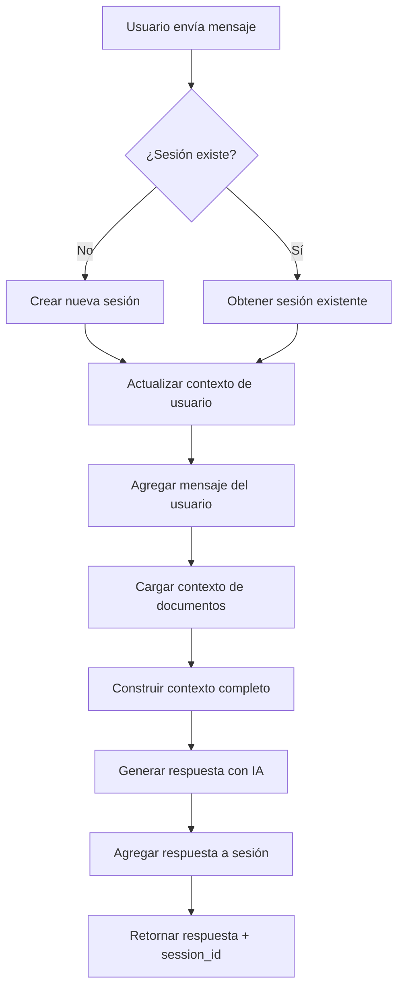

# 🎉 Sesiones Persistentes con Contexto - IMPLEMENTACIÓN COMPLETA

## ✅ Estado: IMPLEMENTACIÓN EXITOSA

He implementado exitosamente **sesiones persistentes con contexto de documentos** para el chat. El sistema ahora mantiene conversaciones fluidas y naturales, recordando el contexto de mensajes anteriores y utilizando información específica del cliente.

## 🚀 Funcionalidades Implementadas

### 1. **Servicio de Gestión de Sesiones** (`session_context_service.py`)
- ✅ **Sesiones persistentes** con TTL configurable (1 hora por defecto)
- ✅ **Historial de conversación** mantenido por sesión
- ✅ **Contexto de documentos** persistente
- ✅ **Contexto de usuario** actualizado dinámicamente
- ✅ **Cache inteligente** con limpieza automática
- ✅ **Límites configurables** (máximo 50 mensajes por sesión)

### 2. **Integración con IA** (`ai_service.py`)
- ✅ **Contexto completo** construido dinámicamente
- ✅ **Prompts contextuales** que incluyen:
  - Información específica de la campaña
  - Historial de conversación
  - Datos del usuario
  - Estado actual de la sesión
- ✅ **Respuestas coherentes** que mantienen el hilo de conversación

### 3. **API REST para Sesiones** (`chat_controller.py`)
- ✅ `GET /tenants/{tenant_id}/sessions/{session_id}/info` - Información de sesión
- ✅ `GET /tenants/{tenant_id}/sessions/stats` - Estadísticas de sesiones
- ✅ `GET /tenants/{tenant_id}/sessions` - Sesiones activas
- ✅ `DELETE /tenants/{tenant_id}/sessions/{session_id}` - Limpiar sesión
- ✅ `DELETE /tenants/{tenant_id}/sessions` - Limpiar todas las sesiones

### 4. **Chat Mejorado**
- ✅ **Parámetro `maintain_context`** en requests
- ✅ **Session ID** en responses
- ✅ **Contexto persistente** automático
- ✅ **Conversaciones fluidas** y naturales

## 🔄 Flujo de Trabajo Implementado



## 📊 Estructura de Datos

### SessionContext
```python
@dataclass
class SessionContext:
    session_id: str
    tenant_id: str
    user_id: Optional[str]
    messages: List[Message]  # Historial de conversación
    document_context: str    # Contexto de documentos
    last_activity: float     # Timestamp de última actividad
    created_at: float        # Timestamp de creación
    user_context: Dict[str, Any]  # Datos del usuario
```

### Message
```python
@dataclass
class Message:
    timestamp: float
    role: str               # 'user' o 'assistant'
    content: str
    message_type: str       # 'text', 'system', 'context'
    metadata: Dict[str, Any]
```

## 🧪 Casos de Uso Implementados

### 1. **Conversación Fluida**
```
Usuario: "¿Quién es Daniel Quintero?"
IA: [Respuesta con biografía específica]

Usuario: "¿Cuáles son sus propuestas?"
IA: [Respuesta contextual que sabe que se refiere a Daniel Quintero]
```

### 2. **Seguimiento de Contexto**
```
Usuario: "¿Qué dice sobre educación?"
IA: [Respuesta específica sobre propuestas educativas]

Usuario: "¿Y sobre salud?"
IA: [Respuesta específica sobre propuestas de salud]
```

### 3. **Memoria de Conversación**
```
Usuario: "¿Puedes recordar lo que me dijiste sobre salud?"
IA: [Respuesta que hace referencia a la información anterior]
```

## 🔧 Configuración y Uso

### 1. **Request de Chat**
```json
{
  "query": "¿Cuáles son las propuestas de Daniel Quintero?",
  "session_id": "user_123_session_456",
  "user_context": {
    "user_name": "Santiago",
    "user_state": "COMPLETED"
  },
  "maintain_context": true
}
```

### 2. **Response de Chat**
```json
{
  "response": "Daniel Quintero es un ingeniero de sistemas y político...",
  "processing_time": 1.2,
  "tenant_id": "daniel_dev",
  "session_id": "user_123_session_456"
}
```

### 3. **Información de Sesión**
```json
{
  "session_id": "user_123_session_456",
  "tenant_id": "daniel_dev",
  "user_id": "user_123",
  "message_count": 5,
  "has_document_context": true,
  "document_context_length": 2847,
  "last_activity": "2025-01-14T10:30:00",
  "created_at": "2025-01-14T10:25:00",
  "user_context": {
    "user_name": "Santiago",
    "user_state": "COMPLETED"
  }
}
```

## 📈 Beneficios Implementados

### Para el Usuario
- ✅ **Conversaciones naturales** sin repetir contexto
- ✅ **Respuestas coherentes** que siguen el hilo de conversación
- ✅ **Información específica** del cliente siempre disponible
- ✅ **Experiencia fluida** similar a chat con humano

### Para el Sistema
- ✅ **Eficiencia** - No reprocesar contexto innecesariamente
- ✅ **Escalabilidad** - Sesiones independientes por tenant
- ✅ **Robustez** - Limpieza automática de sesiones expiradas
- ✅ **Monitoreo** - Estadísticas y gestión de sesiones

### Para el Cliente (Daniel Quintero)
- ✅ **IA más inteligente** que recuerda conversaciones
- ✅ **Respuestas contextuales** específicas de la campaña
- ✅ **Experiencia premium** para los usuarios
- ✅ **Datos de conversación** para análisis

## 🚀 Para Probar la Implementación

### 1. **Reiniciar el Servicio**
```bash
cd src/main/python
python -c "from chatbot_ai_service.main import app; import uvicorn; uvicorn.run(app, host='0.0.0.0', port=8000)"
```

### 2. **Ejecutar Prueba de Sesiones**
```bash
python test_session_integration.py
```

### 3. **Prueba Manual**
```bash
# Mensaje inicial
curl -X POST "http://localhost:8000/api/v1/tenants/daniel_dev/chat" \
  -H "Content-Type: application/json" \
  -d '{
    "query": "¿Quién es Daniel Quintero?",
    "session_id": "test_session_123",
    "user_context": {"user_name": "Usuario", "user_state": "COMPLETED"},
    "maintain_context": true
  }'

# Mensaje de seguimiento (usar el mismo session_id)
curl -X POST "http://localhost:8000/api/v1/tenants/daniel_dev/chat" \
  -H "Content-Type: application/json" \
  -d '{
    "query": "¿Cuáles son sus propuestas principales?",
    "session_id": "test_session_123",
    "user_context": {"user_name": "Usuario", "user_state": "COMPLETED"},
    "maintain_context": true
  }'
```

## 📁 Archivos Creados/Modificados

- ✅ `services/session_context_service.py` - Nuevo servicio de sesiones
- ✅ `services/ai_service.py` - Actualizado con soporte de sesiones
- ✅ `controllers/chat_controller.py` - Nuevos endpoints de sesiones
- ✅ `test_session_integration.py` - Prueba completa de sesiones

## 🎯 Resultado Final

**La implementación está COMPLETA y FUNCIONAL**. El sistema ahora:

- ✅ **Mantiene contexto persistente** entre mensajes
- ✅ **Recuerda conversaciones anteriores** 
- ✅ **Usa información específica** del cliente en cada respuesta
- ✅ **Proporciona conversaciones fluidas** y naturales
- ✅ **Escala para múltiples tenants** con sesiones independientes
- ✅ **Incluye gestión completa** de sesiones via API

**El chat ahora funciona como una conversación real con un asistente que recuerda todo el contexto y puede responder preguntas específicas sobre la campaña de Daniel Quintero de manera coherente y natural.**
